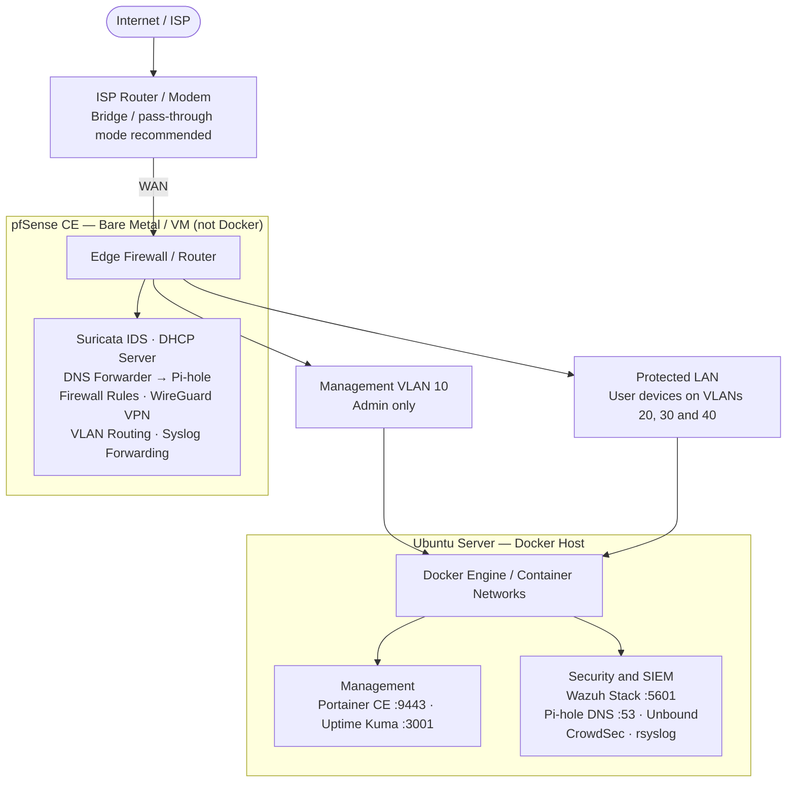

# Secure Home-Office Gateway (SHOG)

A reproducible, open-source defensive security platform for home offices and small teams. Deploy a complete SIEM, DNS filtering, threat detection, and monitoring stack with one command.

[](LICENSE)
[](https://docs.docker.com/compose/)
[](https://ubuntu.com/)

---

## Architecture Overview



**Key principle**: pfSense is the network gateway and stays **outside Docker**.
SHOG services run as containers on an Ubuntu host behind pfSense; install a
native Wazuh agent separately when direct Docker-host telemetry is required.

---

## Quick Start

### Deployment modes

| Mode | CPU | RAM | Disk | Services |
|------|-----|-----|------|----------|
| **Lite minimum** | 2 cores | 2 GB | 20 GB SSD | DNS, logging, CrowdSec, Portainer, Uptime Kuma |
| **Lite recommended** | 2–4 cores | 4 GB | 40 GB SSD | Lite services with more retention/headroom |
| **Full recommended** | 4 cores | 8 GB | 100 GB SSD | Lite services plus Wazuh SIEM and Filebeat |
| **Advanced** | 6+ cores | 16+ GB | 200 GB+ NVMe | Full mode plus optional OpenCTI |

Ubuntu 22.04 or 24.04 LTS is recommended. The lite floor must still be verified
against your DNS volume and log retention before production use.

### One-Command Install

```bash
# 1. Clone the repository
git clone https://github.com/MIjashRajthala/Sentinel-stack.git
cd Sentinel-stack

# 2a. Full deployment (default; includes Wazuh)
./install.sh --mode full

# OR 2b. Low-resource deployment (without Wazuh/Filebeat)
./install.sh --mode lite
```

The installer will:
- Run preflight checks (OS, Docker, RAM, ports, kernel params)
- Create `.env` from `.env.example` if absent
- Generate strong random secrets
- Pull all container images
- Start the stack and verify health
- Save a transcript under `logs/install/`
- Capture redacted diagnostics and suggested next steps if installation fails

### Post-Install

1. **Configure pfSense** using the guide at [`docs/pfsense-setup.md`](docs/pfsense-setup.md)
2. **Access dashboards** (from management subnet only):
   - Portainer: `https://MANAGEMENT_IP:9443`
   - Wazuh (full mode): `https://MANAGEMENT_IP:5601`
   - Uptime Kuma: `http://MANAGEMENT_IP:3001`
   - Pi-hole: `http://MANAGEMENT_IP:8080/admin`

### Test before production

```bash
# Fast, non-deploying checks
./scripts/test-stack.sh --mode lite --level static
./scripts/test-stack.sh --mode full --level static

# Disposable-host deployment test
./scripts/test-stack.sh --mode lite --level integration
```

Each run records a transcript, exact commands, a summary, and—on failure—a
diagnostic bundle with classified next steps and a reproduction command. See
[`docs/testing.md`](docs/testing.md).

---

## What's Included

| Service | Purpose | Network |
|---------|---------|---------|
| **pfSense CE** | Edge firewall, IDS, VPN, DHCP, VLANs | Physical/VM |
| **Portainer CE** | Docker management UI | Management |
| **Pi-hole** | DNS filtering, ad/tracker blocking | Security |
| **Unbound** | Recursive DNS resolver (root servers) | Security |
| **Wazuh** | SIEM: Manager + Indexer + Dashboard | Security |
| **Wazuh Agent** *(host opt.)* | Native host telemetry; install separately | Physical/VM |
| **rsyslog** | Central syslog receiver (pfSense/Suricata) | Security |
| **Filebeat** | Log shipper to Wazuh Indexer | Security |
| **CrowdSec** | Behavioural threat detection + bouncer | Security |
| **Uptime Kuma** | Service availability monitoring | Management |
| **OpenCTI** *(opt)* | Threat intelligence platform | Security |
| **Alerting** *(opt)* | Webhook/email notifications | Monitoring |

---

## Security Features

- **Network segmentation**: Three isolated Docker networks (management, security, monitoring)
- **No exposed internals**: Databases and indexers not reachable from LAN
- **Admin UIs bound to `MANAGEMENT_IP`**: Not accessible from general LAN
- **Auto-generated secrets**: No hardcoded passwords
- **Security headers**: CSP, HSTS, X-Frame-Options where supported
- **Least privilege**: Dropped capabilities, read-only mounts, `no-new-privileges`
- **Health checks**: All services with automatic restart
- **Log rotation**: Persistent logs with size-based rotation
- **Image pinning**: All images pinned to specific versions
- **Backup/restore**: Included scripts and documentation

---

## Profiles (Optional Services)

| Profile | Command | Description |
|---------|---------|-------------|
| `siem` | `docker compose --profile siem up -d` | Wazuh and Filebeat; activated by `--mode full` |
| `alerting` | `docker compose --profile alerting up -d` | Discord/Slack/email alerts |
| `opencti` | `docker compose --profile opencti up -d` | Threat intel platform (8GB+ extra RAM) |
| `host-bouncer` | `docker compose --profile host-bouncer up -d` | CrowdSec iptables bouncer on host |

---

## Repository Structure

```
shog/
├── docker-compose.yml              # Main stack definition
├── compose.override.example.yml    # Override template
├── .env.example                    # Configuration template
├── install.sh                      # One-command installer
├── uninstall.sh                    # Removal with warnings
├── configs/                        # Service configurations
│   ├── unbound/
│   ├── pihole/
│   ├── rsyslog/
│   ├── crowdsec/
│   └── wazuh/
├── scripts/
│   ├── preflight-check.sh          # System validation
│   ├── generate-secrets.sh         # Secret generation
│   ├── backup.sh                   # Backup all data
│   ├── health-check.sh             # Service health monitor
│   ├── diagnose.sh                 # Redacted diagnostic bundle collector
│   └── test-stack.sh               # Static/smoke/integration tests
├── docs/
│   ├── architecture.md             # Architecture & Mermaid diagrams
│   ├── pfsense-setup.md            # pfSense configuration
│   ├── threat-model.md             # Threat model & controls
│   ├── evaluation-plan.md          # Testing & metrics
│   ├── testing.md                  # Automated test and reproduction guide
│   ├── security-hardening.md       # Hardening guide
│   ├── troubleshooting.md          # Common issues
│   └── restore.md                  # Restore procedures
├── backups/                        # Backups (created)
└── logs/                           # Test, install, and diagnostic artifacts
```

---

## Documentation

| Document | Purpose |
|----------|---------|
| [`docs/architecture.md`](docs/architecture.md) | Full architecture, data flow, network diagram |
| [`docs/pfsense-setup.md`](docs/pfsense-setup.md) | pfSense WAN/LAN/VLAN, DHCP, DNS, Suricata, WireGuard |
| [`docs/threat-model.md`](docs/threat-model.md) | Assets, threat actors, attack paths, controls, residual risk |
| [`docs/evaluation-plan.md`](docs/evaluation-plan.md) | Testing plan, metrics, SUS questionnaire |
| [`docs/testing.md`](docs/testing.md) | Automated tests, diagnostics, and resource-validation protocol |
| [`docs/security-hardening.md`](docs/security-hardening.md) | Additional hardening beyond defaults |
| [`docs/troubleshooting.md`](docs/troubleshooting.md) | Common problems and solutions |
| [`docs/restore.md`](docs/restore.md) | Disaster recovery procedures |

---

## License

MIT License — See [LICENSE](LICENSE) for details.

**Disclaimer**: This is a defensive security research and education project. No warranty is provided. Review all configurations before production deployment. pfSense is a registered trademark of Netgate.
