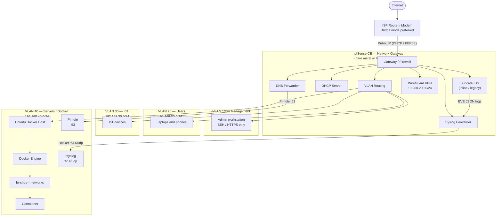
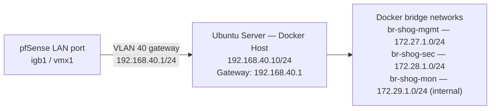
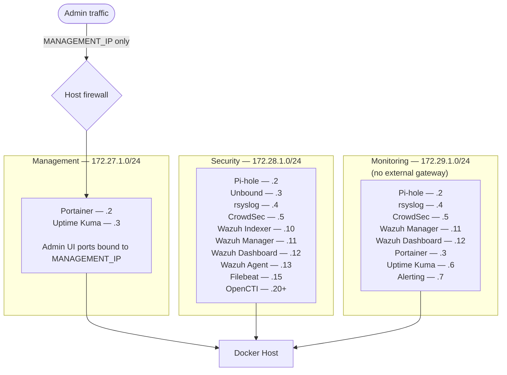
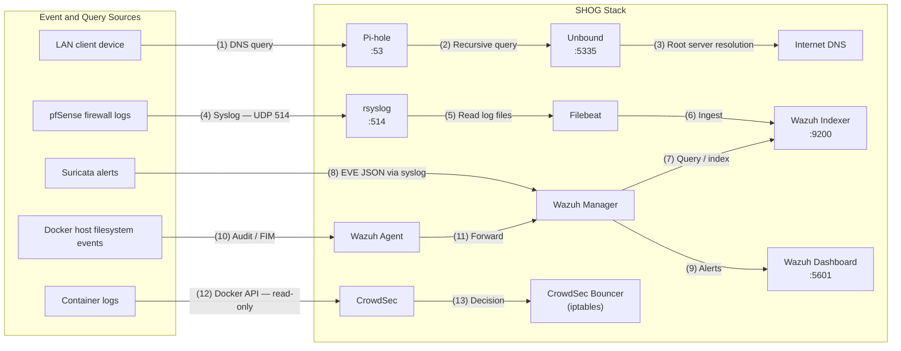

# SHOG Architecture

## Network Architecture

## pfSense to Docker Host — Physical/Logical Connections

## Docker Network Segmentation

## Data Flow Diagram

## Component Inventory

| # | Component | Image | Version | Purpose | Data Volume |
|---|-----------|-------|---------|---------|-------------|
| 1 | unbound | mvance/unbound | 1.19.0 | Recursive DNS | unbound-data |
| 2 | pihole | pihole/pihole | 2024.02.2 | DNS filtering | pihole-etc, pihole-dnsmasq |
| 3 | rsyslog | rsyslog/syslog_appliance_alpine | 8.2310.0 | Log receiver | rsyslog-data, rsyslog-spool |
| 4 | crowdsec | crowdsecurity/crowdsec | v1.6.0 | Threat detection | crowdsec-config, crowdsec-data |
| 5 | crowdsec-bouncer | crowdsecurity/iptables-bouncer | v0.0.28 | IP blocking | crowdsec-bouncer-* |
| 6 | wazuh-indexer | wazuh/wazuh-indexer | 4.7.2 | Search/Analytics | wazuh-indexer-data |
| 7 | wazuh-manager | wazuh/wazuh-manager | 4.7.2 | SIEM engine | wazuh-manager-var-ossec |
| 8 | wazuh-dashboard | wazuh/wazuh-dashboard | 4.7.2 | Web UI | wazuh-dashboard-data |
| 9 | wazuh-agent | wazuh/wazuh-agent | 4.7.2 | Host telemetry | wazuh-agent-var-ossec |
| 10 | portainer | portainer/portainer-ce | 2.19.4 | Container mgmt | portainer-data |
| 11 | uptime-kuma | louislam/uptime-kuma | 2.3.2 | Monitoring | uptime-kuma-data |
| 12 | filebeat | docker.elastic.co/beats/filebeat-oss | 8.11.4 | Log shipper | filebeat-data, filebeat-logs |
| 13 | alerting | ghcr.io/containrrr/shoutrrr | 0.8.0 | Notifications | alerting-data |
| 14 | opencti-platform | opencti/platform | 6.0.0 | Threat intel | opencti-data |
| 15 | opencti-redis | redis | 7.2.4-alpine | Cache | opencti-redis-data |
| 16 | opencti-elasticsearch | docker.elastic.co/elasticsearch/elasticsearch | 8.11.4 | Search | opencti-es-data |
| 17 | opencti-minio | minio/minio | RELEASE.2024-01 | Object store | opencti-minio-data |
| 18 | opencti-rabbitmq | rabbitmq | 3.12.13-mgmt-alpine | Message queue | opencti-rabbitmq-data |

## Port Matrix

| Service | Container Port | Host Binding | Description |
|---------|---------------|--------------|-------------|
| Unbound | 53/tcp, 53/udp | 127.0.0.1:5335 | Recursive DNS (localhost only) |
| Pi-hole DNS | 53/tcp, 53/udp | 0.0.0.0:53 | DNS for LAN clients |
| Pi-hole Web | 80/tcp | MANAGEMENT_IP:8080 | Admin UI |
| rsyslog | 514/tcp, 514/udp | 0.0.0.0:514 | Syslog from pfSense |
| Wazuh Dashboard | 5601/tcp | MANAGEMENT_IP:5601 | SIEM web UI |
| Portainer | 9443/tcp, 9000/tcp | MANAGEMENT_IP:9443/9000 | Docker mgmt |
| Uptime Kuma | 3001/tcp | MANAGEMENT_IP:3001 | Monitoring UI |
| OpenCTI | 8080/tcp | MANAGEMENT_IP:8088 | Threat intel (optional) |

**Internal-only ports** (not exposed to host): Wazuh Indexer :9200, Wazuh Manager :1514/:55000, CrowdSec :8080, Redis :6379, RabbitMQ :5672, MinIO :9000.

## Audit Data Flow Summary

| Source | Log Type | Transport | Destination | Retention |
|--------|----------|-----------|-------------|-----------|
| pfSense firewall | Filter logs | Syslog UDP/514 | rsyslog -> Filebeat -> Wazuh | 90 days (configurable) |
| Suricata | EVE JSON | Syslog TCP/514 | rsyslog -> Filebeat -> Wazuh | 90 days |
| Docker host | Auth, kernel, FIM | Wazuh agent | Wazuh Manager -> Indexer | 90 days |
| Docker containers | Container logs | Docker API (read-only) | CrowdSec analysis + host journal | 30 days |
| Pi-hole | DNS queries | Local SQLite | Pi-hole database (90 days) | 90 days |
| CrowdSec | Threat detections | Local + API | CrowdSec database + console | 30 days |
